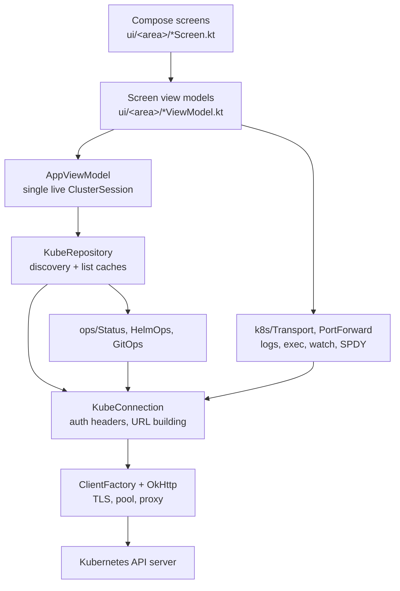

# Architecture

The Android app is branded **KubeDeck** (`app_name` in `res/values/strings.xml`), with source
application id `dev.rafa.kubemobile`. One Gradle module, `:app` (`settings.gradle.kts` includes only
`:app`), namespace `dev.rafa.kubemobile`. All source lives under
`app/src/main/java/dev/rafa/kubemobile/`.

## Module and package layout

| Package | Files | Responsibility |
| --- | --- | --- |
| (root) | `MainActivity.kt` | Single activity. `enableEdgeToEdge()`, sets `KubeTheme { KubeRoot() }`, and obtains the one `AppViewModel` via `viewModel()`. |
| `config` | `ClusterProfile.kt`, `KubeconfigParser.kt`, `KeystoreCrypto.kt` | The persisted connection record and its security. `ClusterProfile` is the flattened `cluster` + `context` + `user` triple. `KubeconfigParser` turns kubeconfig YAML into profiles and collects warnings. `KeystoreCrypto` is the AES-256-GCM / AndroidKeyStore primitive. |
| `data` | `ClusterStore.kt`, `KubeRepository.kt` | Storage and orchestration. `ClusterStore` encrypts profiles into DataStore. `KubeRepository` owns connection caching, discovery snapshots, list caching and every resource operation; `ClusterSession` is a live connection plus its catalog and namespace list. |
| `k8s` | `Http.kt`, `Api.kt`, `Json.kt`, `Yaml.kt`, `Pem.kt`, `Transport.kt`, `PortForward.kt`, `SpdyStream.kt`, `SpdyDictionary.kt` | The wire layer. TLS-configured OkHttp clients, REST verbs, API discovery, JSON/YAML utilities, PEM handling, and the streaming transports (logs, watch, exec, metrics) plus the SPDY/3.1 port-forward implementation. |
| `ops` | `Status.kt`, `HelmOps.kt`, `GitOps.kt` | Domain interpretation and controller operations. Health/condition interpretation, Helm 3/2 release decoding and uninstall, and Flux / Argo CD / workload-lifecycle / node (cordon, drain) actions — all as plain API-server calls. |
| `ui` | `Navigation.kt`, `AppViewModel.kt`, `ScreenViewModel.kt`, `UiSupport.kt`, `Theme.kt`, `components/Common.kt` | App shell, navigation graph, app-wide state, the central `Spacing` scale, formatting/errors/colour helpers, theme and shared composables. |
| `ui/*` | `clusters/`, `browse/`, `detail/`, `helm/`, `flux/`, `argo/`, `events/`, `settings/` | One directory per screen area, including the cluster-summary landing destination. `detail/WorkloadPods.kt` is the shared workload→pods resolver used by the detail screen's Pods tab and merged log view. See [FEATURES.md](FEATURES.md). |
| `ui/components` | `Common.kt` | Shared primitives including responsive `TabStrip`: it chooses an evenly distributed `PrimaryTabRow` or scrollable `PrimaryScrollableTabRow` from measured labels and available width. Used by Object detail, Helm release detail and GitOps. |

## Request path

The path a normal read or write takes, in order:

1. **Screen.** A composable under `ui/<area>/` reads state from its view model with
   `collectAsStateWithLifecycle()`. Screens that need personal state build their view model with
   the `screenViewModel` helper (`ui/ScreenViewModel.kt`), which wires the app-wide `AppViewModel`
   and a `SavedStateHandle` into a factory built by `viewModelFactory { initializer { … } }`.
2. **Screen view model.** It resolves the resource identity into an `ApiResource` against the live
   catalog and calls the repository on `viewModelScope`. It never touches OkHttp.
3. **`AppViewModel`** (`ui/AppViewModel.kt`) holds the *single* live `ClusterSession` in
   `sessionState: StateFlow<SessionState>` (`Idle` / `Connecting` / `Ready` / `Failed`) and exposes
   `session`, `catalog`, `namespaces`, `profiles`, `activeId`. Its `connect(profile)` is
   mutex-guarded and reuses an existing session for the same profile id, so concurrent callers
   share one attempt. Screen view models reach the API as `app.repository.*` with `app.session`.
4. **`KubeRepository`** (`data/KubeRepository.kt`) is the only place that knows HTTP verbs for
   resources. It looks the resource up in `session.catalog`, builds the path from
   `ApiResource.basePath(namespace)` / `collectionPath(namespace)`, and calls
   `session.connection`. It invalidates caches before mutations.
5. **`KubeConnection`** (`k8s/Http.kt`) builds the URL (`url(path, query)` appends path segments to
   the profile's base URL), adds `Authorization` (bearer token, else HTTP Basic, else nothing) and a
   `User-Agent` (`kubemobile/1.0 (android)`), serialises the JSON body, and picks the ordinary or
   the streaming OkHttp client. `execute()` runs on `Dispatchers.IO`.
6. **OkHttp.** `ClientFactory.shared` caches clients per cluster. A non-2xx response becomes a
   `KubeApiException(code, reason, bodyText)` carrying the Kubernetes `Status` message; `toUiError`
   then maps it to the user-facing title/detail shown by `ErrorState` and snackbars.

Reads go through `get`; writes through `post` / `put` / `patch` / `delete`. `patch` defaults to
`application/json-patch+json` (`KubeConnection.JSON_PATCH`), with
`application/merge-patch+json` (`MERGE_PATCH`) and `application/strategic-merge-patch+json`
(`STRATEGIC_MERGE_PATCH`) selected explicitly where the object's semantics require them.

## Discovery, and why it is cached

`Discovery.load(connection)` (`k8s/Api.kt`) walks the discovery documents:

1. `GET /api` → core `versions` (e.g. `v1`).
2. `GET /apis` → every API group with its `versions[]` and `preferredVersion`.
3. `GET /api/<version>` for each core version, and `GET /apis/<group>/<version>` for **every served
   version of every group** — not just the preferred one. This is deliberate: kinds that exist only
   in a non-preferred version (for example Flux `Alert`/`Provider` under
   `notification.toolkit.fluxcd.io/v1beta3`) would otherwise be invisible.
4. `parseResources` drops sub-resources (any name containing `/`, such as `pods/log`) and any
   resource that supports neither `list` nor `get`.
5. `dedupe` collapses the version union to exactly one `ApiResource` per
   `(group, plural name)`: the group's preferred version when it defines the resource, otherwise the
   most stable version by `versionRank` (`v2` > `v1` > `v1beta2` > `v1alpha1`). Keying on the plural
   name rather than the kind keeps distinct resources such as `replicationcontrollers` separate.
   Every caller — `ApiCatalog.forKind`/`forResource`, `create`/`apply`/`replace` and the UI's route
   key — assumes one addressable resource per kind, which is what makes this necessary.

Each group version is fetched independently inside `runCatching`, so a version that 404s, is
forbidden, or fails to parse contributes nothing instead of breaking the whole snapshot.

Because discovery is a dozen-plus round trips and changes rarely, the resulting `ApiCatalog` is:

- held on the `ClusterSession` (`session.catalog`), and
- written to a JSON file at `context.filesDir/discovery/<profileId>.json`, valid for **10 minutes**
  (`KubeRepository.CATALOG_TTL_MS`).

On a cold start the cached file is reused when it is younger than the TTL; if a live discovery
fails (offline, forbidden), the cached snapshot is returned rather than failing the screen. If
discovery never succeeded, the file is the last resort before the error surfaces. The catalog is
what makes **any CRD browsable without per-operator code** — the UI enumerates whatever the server
advertises.

The Settings screen reports the snapshot size (`<n> API groups · <n> resource kinds`) and offers
*Reload discovery*, which calls `AppViewModel.reloadDiscovery()` →
`repository.invalidate(profileId)` → a forced re-fetch.

**List caching** remains a repository capability but is not active in current UI call sites:
`KubeRepository.list` stores first-page results in an in-memory `HashMap` keyed by
`clusterId|qualified|namespace|labelSelector|fieldSelector`, valid for **20 seconds**
(`LIST_TTL_MS`), but lookup only occurs when a caller passes `useCache = true` and is not following a
`continue` token. No current caller opts in, so lists are re-fetched. `invalidate(clusterId)` clears
matching entries, drops pooled clients, forgets the connection/session for that profile and deletes
its discovery file.

## Credential storage

Two layers, in `data/ClusterStore.kt` and `config/KeystoreCrypto.kt`:

1. **Serialisation** — the profile list is encoded with `kotlinx.serialization`
   (`KubeJson`, `ListSerializer(ClusterProfile.serializer())`).
2. **Encryption** — `KeystoreCrypto.encryptText` encrypts the JSON with `AES/GCM/NoPadding`, a
   256-bit key generated under alias `kubemobile.store.v1` in the `AndroidKeyStore`, a random
   12-byte IV, and a 128-bit tag. The stored blob is `iv || ciphertext||tag`; the caller Base64s it.
   The key is created on first use with `setRandomizedEncryptionRequired(true)` and never leaves the
   keystore.
3. **Persistence** — a DataStore Preferences file named `clusters`, under the keys
   `profiles.v1` (the Base64 blob) and `active.v1` (the active profile id).

Decoding is best-effort: a failure (for example a key that no longer exists) yields an empty list
rather than a crash. `upsert` replaces any existing entry with the same `server|contextName`
identity, so re-importing an evolving kubeconfig updates rather than duplicates. Mutations also
repair the active id if it no longer matches a stored profile.

Consequences worth knowing: `android:allowBackup="false"` means profiles are not backed up, and
because the key is per-install, a restored copy of the DataStore file on another device is
undecryptable by design.

## Transports

| Feature | Endpoint | Protocol |
| --- | --- | --- |
| List/get/create/replace/patch/delete/scale | `/api/...`, `/apis/...` | REST over HTTPS, JSON bodies. `pods/.../log` writes are not used; patches carry a JSON-patch, merge-patch or strategic-merge-patch content type. |
| Logs | `GET /api/v1/namespaces/<ns>/pods/<pod>/log` | **Plain-text streaming GET.** `follow`, `tailLines`, `timestamps`, `previous`, `container`, `sinceSeconds` are query parameters. `Logs.stream` reads it line by line with `body.source().readUtf8Line()`. No `Accept` header is sent on purpose — asking for `text/plain` makes the API server answer 406. `Logs.streamMerged` runs one `stream` per pod into a `channelFlow`, optionally prefixing each line with `pod | `; a pod that ends or fails mid-stream only drops its own output, and a failure is rethrown only when no line was ever produced. |
| Watch | `GET <collection>?watch=true` | **Streaming GET**, one JSON document per line (`{"type":…,"object":…}`). `Watches.stream` in `k8s/Transport.kt` implements it; no screen uses it (see [../README.md](../README.md#what-it-deliberately-does-not-do)). |
| Exec | `GET /api/v1/namespaces/<ns>/pods/<pod>/exec` | **WebSocket**, subprotocol `v4.channel.k8s.io`. Binary frames are `[channel byte][payload]`: `0` stdin, `1` stdout, `2` stderr, `3` error, `4` resize, `-1`/close. `stdin`, `stdout`, `stderr`, `tty` and repeated `command` are query parameters. `Exec.start` waits for the upgrade (30 s) and surfaces an error-channel failure to the caller. |
| Port forwarding | `GET /api/v1/namespaces/<ns>/pods/<pod>/portforward?ports=<n>` | **SPDY/3.1 frames inside a WebSocket**, negotiated via `Sec-WebSocket-Protocol: SPDY/3.1+portforward.k8s.io`. `SpdyMultiplexer` (`k8s/SpdyStream.kt`) owns framing: frame reassembly across WebSocket messages, header-block compression with zlib against the fixed SPDY/3.1 preset dictionary (`SpdyDictionary.kt`), and `SYN_STREAM`/`SYN_REPLY`/data/`RST_STREAM`/`PING`. |
| Metrics | `GET /apis/metrics.k8s.io/<version>/pods` and `/nodes` (version from discovery) | REST JSON. `Metrics.podMetrics` returns usage keyed `namespace/name` (summing `containers[].usage`); `Metrics.nodeMetrics` returns usage keyed by node name (a node metric has one top-level `usage` block, not `containers[]`). `Metrics.parseQuantity` handles CPU (`n`/`u`/`m`/cores) and memory (`Ki`…`Ti`, `K`…`T`) suffixes; `Metrics.sumUsage` rolls readings up, leaving a metric null when no member reports it. Both use the cluster-wide path (`basePath(null)`). Pod metrics feed the pod list, Pod detail and cluster-summary usage; the summary's allocatable denominator comes from node `status.allocatable`, not node metrics. |
| Eviction | `POST /api/v1/namespaces/<ns>/pods/<name>/eviction` | REST JSON with `policy/v1` `Eviction`. Used by node drain so PodDisruptionBudgets are honoured; a PDB-refused pod throws the API server's message. |

`SpdyMultiplexer` implements no flow control, matching the `moby/spdystream` peer: inbound
`SETTINGS`/`WINDOW_UPDATE` are accepted and ignored, and data is never written before the peer's
`SYN_REPLY` established the stream.

Port forwarding's per-connection semantics (in `k8s/PortForward.kt`) mirror `kubectl`:

- A loopback `ServerSocket` is bound **before** the tunnel opens, so the real local port is known
  and shown to the user.
- The server's `pods/portforward` endpoint expects one `error` + `data` stream pair per TCP
  connection, sharing a `requestID`, created `error` first and then `data`; the error stream is
  write-closed immediately. `PortForward.start` opens pair 0 as a probe and blocks until the server
  establishes the data stream — that is what proves the tunnel is usable.
- `Session.serve()` accepts local connections and gives each its own stream pair; `Link` pumps bytes
  in both directions and keeps up/down counters, which the UI polls once per second.

TLS material is prepared by `Pem` (`k8s/Pem.kt`): `certificate-authority-data`,
`client-certificate-data` and `client-key-data` are decoded from the profile, private keys are
normalised to PKCS#8 (PKCS#1 RSA and SEC1 EC blocks are re-wrapped with a small DER writer because
Android's default provider rejects them), and the client keystore is a PKCS#12 loaded with the
password `kube`. `insecure-skip-tls-verify` installs a trust-all manager and a permissive hostname
verifier; `tls-server-name` installs a verifier that checks the presented certificate against that
name instead of the URL host; `proxy-url` becomes an HTTP proxy on the OkHttp client.

`ClientFactory` caches clients by a key covering the profile id, server, insecure flag, CA/client
cert/client key hash codes, proxy URL and TLS server name, with separate maps for the normal and
streaming clients. All clients share one `ConnectionPool(8, 5, TimeUnit.MINUTES)` and one
`Dispatcher` with `maxRequestsPerHost = 12`. Timeouts: connect 20 s; call timeout disabled (0); read
90 s normally and unbounded for streaming; write 60 s; a 30 s WebSocket ping interval on the
streaming client.

## Status interpretation

`ops/Status.kt` is the app's whole model of "is this thing healthy?".

- `conditions(obj)` parses `status.conditions[]` into `Condition(type, status, reason, message,
  lastTransitionTime, observedGeneration)`.
- `readyCondition(obj)` picks, in order: a `Ready` condition, then `Synced`, then a true
  `Available`, then the first condition whose status is `False`.
- `isStale(obj)` compares `metadata.generation` with `status.observedGeneration`: true when the
  controller has not yet observed the current generation.
- `Status.health(obj, kind)` returns a `ResourceHealth(label, detail, tone, progress)`. The tone enum
  is `OK`, `WARN`, `BAD`, `PROGRESS`, `NEUTRAL`; `progress` is a 0..1 fraction. `ui/UiSupport.kt`
  maps tones to colours in `toneColors`: fixed green/amber for `OK`/`WARN` (light and dark variants),
  and the Material scheme's `errorContainer` / `secondaryContainer` / `surfaceVariant` for
  `BAD` / `PROGRESS` / `NEUTRAL`.

Dispatch is by kind:

| Kind | Interpretation |
| --- | --- |
| `Pod` | `status.phase` plus container readiness/restarts; container `state.waiting.reason` / `terminated.reason` wins the label when the pod is not healthy; a `deletionTimestamp` reads *Terminating*. |
| `Deployment`, `ReplicaSet`, `StatefulSet`, `DaemonSet`, `ReplicationController` | desired vs ready vs available vs updated, with `ReplicaFailure`, `Progressing` and `Available` conditions and the staleness check. A zero-replica workload reads *Scaled to 0*. |
| `Job` / `CronJob` | completions, active and failed counts; CronJob shows *Suspended* / *Active* / *Idle* and the last schedule time. |
| `PersistentVolumeClaim` | `status.phase` (`Bound`/`Lost`) and capacity. |
| `Node` | `Ready` condition plus `spec.unschedulable`, reading *Ready,SchedulingDisabled* when cordoned; shows derived `node-role.kubernetes.io/*` roles. |
| `Namespace` | `status.phase`. |
| `Service` | `spec.type`. |
| `HelmRelease` | Flux HelmRelease: `Ready` condition, `lastAppliedRevision`, suspend state and `status.failures`. |
| `Application`, `ApplicationSet` | Argo CD roll-up: `status.health.status` × `status.sync.status`, with a running/terminating `operationState` shown as progress. |
| `Event` | the event `type`. |
| everything else | `readyCondition` — the generic path that gives every CRD a meaningful badge without any per-operator code. |

`Status.detailRows(obj, kind)` adds the kind-specific rows shown on the detail screen's Summary tab
(pod node/IP/QoS, workload replica counts and strategy, service type and ports, ingress rules, PVC
class/capacity, node kubelet/OS/runtime, HelmRelease chart/source, Kustomization path/prune, Argo
Application project/sync/health). Every kind additionally gets `Created` and `Generation` from the
metadata, so no object's summary is ever empty.

## Notable design decisions in the code

- **One session, many screens.** `AppViewModel` keeps exactly one `ClusterSession`; a cluster switch
  is a single state change rather than a per-screen cache invalidation cascade.
- **Identity by resource key.** A route carries `group|version|plural|kind`
  (`UiSupport.RESOURCE_KEY_SEPARATOR`) rather than object state, and `ResourceRef.resolve` re-resolves
  it against a freshly loaded catalog so a route survives process death and discovery refresh.
- **Sentinel names.** `NO_NAMESPACE = "_none_"` stands in for cluster-scoped objects in routes and
  `ALL_NAMESPACES = "_all_"` for a cluster-wide list; both are values that cannot legally be a
  namespace name.
- **One workload→pods resolver.** `ui/detail/WorkloadPods.kt` resolves a workload's pods from its
  own `spec.selector.matchLabels` as a server-side `labelSelector` (falling back to
  `ownerReferences`, and stepping a Deployment through its ReplicaSets or a CronJob through its
  Jobs). The detail screen's Pods tab and the merged log view both call it, so the two can never
  disagree about what a workload contains.
- **Namespace memory is in-memory and split in two.** `AppViewModel` keeps a per-cluster
  Browse-scoped namespace (`browseNamespaces`) and a per-cluster, per-resource list namespace
  (`namespaceChoice`), both for the life of the process only. Browse chooses the namespace before a
  kind is opened and the resource list inherits it; opening a kind from Browse also records the
  choice for that kind, so the list opens where Browse was scoped.
- **Errors are values.** Failures become `UiError(titleRes, message, detail)` via `toUiError`, with a
  separate `discovery` mode for connection-time failures, so every screen renders the same
  `ErrorState`.
- **Serialisation is lenient.** `KubeJson` sets `ignoreUnknownKeys` and `isLenient`, and every JSON
  accessor resolves through `JsonObject.path()` returning `null` rather than throwing, so a
  malformed payload degrades a row instead of crashing a screen.
- **YAML round-trips without loss.** `YamlIo` uses SnakeYAML's `SafeConstructor` with a 32 MiB
  code-point limit, 200 aliases and duplicate keys allowed, and dumps in block style with indent 2
  and no line wrapping, so arbitrary CRD payloads survive a trip through the editor.
